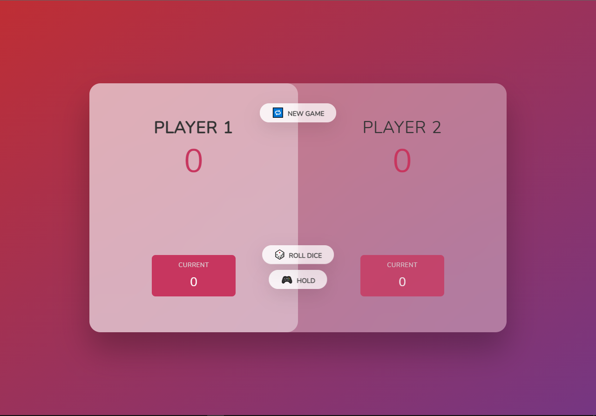
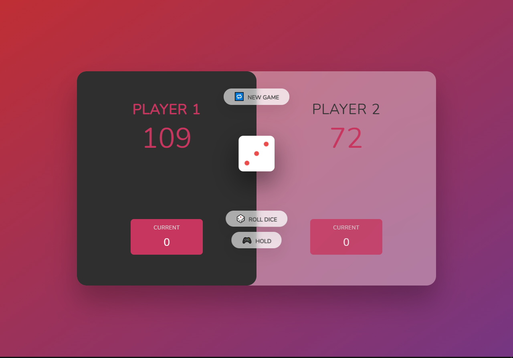

# [Pig-Game-JS](https://noorali-180.github.io/Pig-Game-JS/)
## click the name above 👆 to see the webpage.
### but I suggest that download the code and run it locally in your system 😉, it will give a better exprience 😊 because somehow github hosting (github pages) giving the UI a weird look.🙃

originally the UI looks like this.👆

#### Game Rules.
1). when user roll the dice by clicking the roll dice button, a dice will appear and shows a score which will be added to the current score of the active player.
2). if dice shows the one, current score of active player will be gone and player will be switched.
3). when user clicks the hold button, current score will be added to the total score of active player, and player will be switched.
4). any one of the player who reaches the 100 score mark will be the winner of the game.
5). when user clicks the new game button, game will be restarted, with the initial conditions also player 1 as an active player.

(hope 👆 will help to understand the strategy.)

